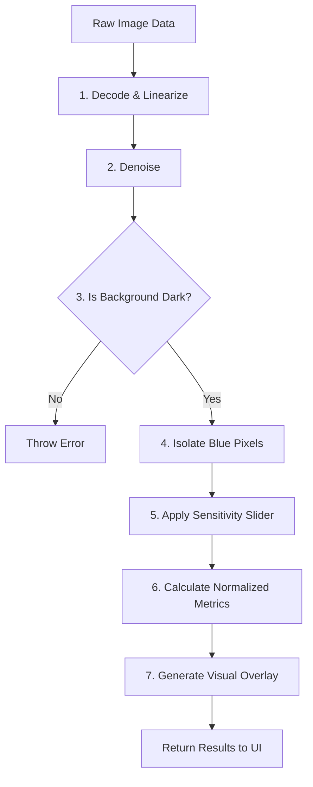

# Luminol Blue Intensity Analyzer

## Overview
The Luminol Blue Intensity Analyzer is a specialized, local-only web application designed to measure the chemiluminescent intensity of biological samples. It automates the process of identifying glowing regions in an image and calculating their brightness with high accuracy, replacing older manual tools.

All processing occurs strictly on your local machine to ensure data privacy and high performance.

## System Architecture

The application is split into two main parts:
- **Frontend**: A user interface that allows users to upload images, adjust sensitivity, and view results instantly.
- **Backend**: A Python-based server that performs the heavy lifting of image analysis using advanced computer vision techniques.

## Backend Processing Pipeline

When an image is sent to the backend, it passes through a strict, linear pipeline to extract accurate physical light measurements. Here is exactly what happens under the hood, step by step.

### 1. Decoding & Linearisation
**Goal:** Convert the image into a format that represents true, physical light intensity.
- **RAW files (DNG, CR2, etc.)**: The image is decoded using the **`rawpy`** library. This extracts raw sensor data, bypassing any artificial enhancements made by the camera (like contrast curves or fake colors).
- **JPEG/PNG files**: The image is decoded using **`OpenCV`**. Since JPEGs apply a visual "gamma curve" to look good on screens, the backend mathematically reverses this curve to convert the pixels back into raw, linear light data.

### 2. Denoising
**Goal:** Remove camera sensor grain without blurring the edges of the glow.
- The system applies a mild noise-reduction filter using **`OpenCV`**. This ensures that random speckles of light don't artificially inflate the blue intensity measurements.

### 3. Black Box Validation
**Goal:** Ensure the photo was taken in the correct experimental environment.
- The backend checks the overall brightness of the image using array mathematics via **`NumPy`**. It expects the vast majority of the image to be pitch black. If too much ambient light is detected (e.g., room lights were left on), the system flags it as an error to prevent skewed data.

### 4. Blue Glow Detection
**Goal:** Isolate the areas that are actually glowing blue.
- The system scans every pixel and asks a simple question: *Is the blue channel significantly stronger than both the red and green channels?* 
- Any pixel that passes this test (and isn't just dark background noise) is grouped into a "valid blue mask."

### 5. Sensitivity Filtering (Core Mask)
**Goal:** Allow the user to fine-tune which part of the glow is actually measured.
- This step uses the "Sensitivity" slider from the frontend. Using statistical percentiles via **`NumPy`**, the system filters the previously detected blue pixels based on how bright they are.
- A sensitivity of `0` keeps all blue pixels (even the faintest edges). A sensitivity of `100` trims away everything except the absolute brightest 1% of the glow.
- The remaining pixels form the final **Core Region**.

### 6. Metrics Calculation
**Goal:** Generate the final scientific numbers.
- The system calculates statistics strictly inside the Core Region. It computes the **Mean Intensity** (average brightness) and **Integrated Intensity** (total light emitted).
- These raw baseline numbers are then mathematically divided by the camera's **Shutter Speed** and **ISO**. This vital step "normalizes" the data, meaning you can fairly compare a photo taken at 1 second exposure against a photo taken at 5 seconds exposure.

### 7. Overlay Generation
**Goal:** Show the user exactly what was measured.
- **`OpenCV`** draws a semi-transparent cyan fill and green border over the Core Region you just calculated. This is converted into an image file and sent back to the frontend, allowing the user to visually verify that the correct area was analyzed.

## Key Libraries Used
- **`FastAPI`**: Handles all the web requests and server communication rapidly.
- **`OpenCV` (cv2)**: Handles image decoding, geometry, drawing overlays, and noise reduction.
- **`NumPy`**: Powers the high-speed mathematical array operations, statistical percentiles, and image masking.
- **`Rawpy`**: Specifically reads and decodes raw uncompressed camera data (like DNG files) directly into pure light values.